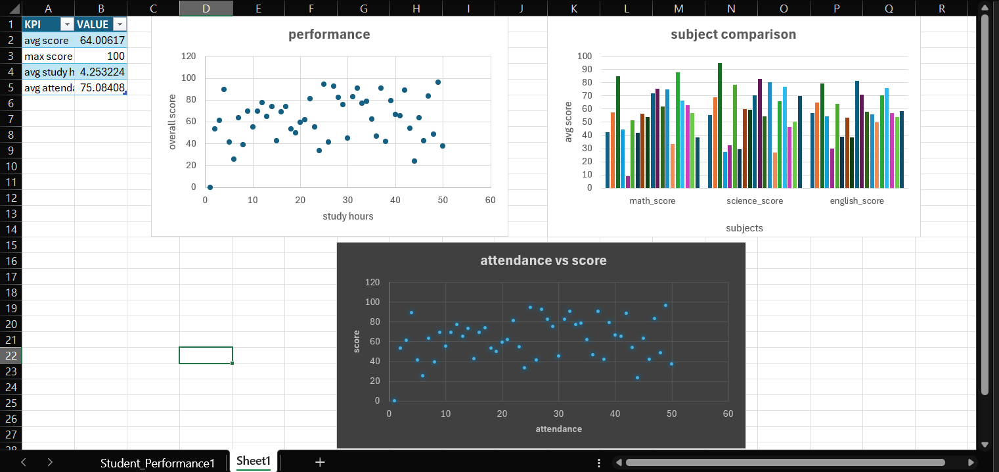

# Student Performance Analysis

## Overview
This project analyzes student performance based on study habits and attendance.

## Tools Used
- Python (Pandas, Matplotlib, Seaborn)
- Scikit-learn
- Microsoft Excel

## Features
- Data Cleaning
- Data Visualization
- Machine Learning Model
- Excel Dashboard

## Dashboard

## Conclusion
Study hours and attendance strongly affect student performance.
